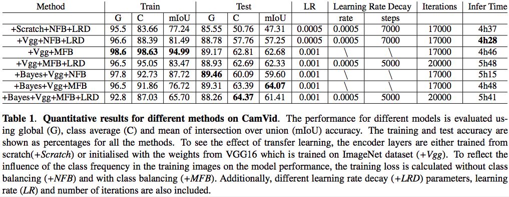
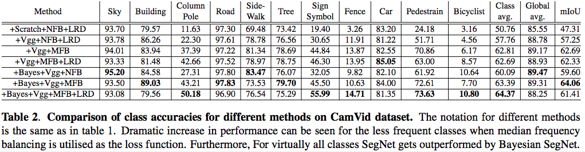
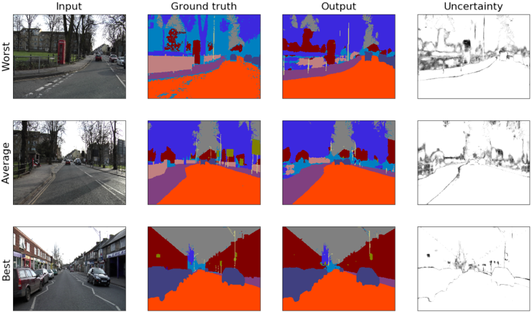

# SegNet- tensorflow implementation
The implementation for SegNet and Bayesian SegNet is based on two papers listed below: 

http://arxiv.org/abs/1511.02680
Alex Kendall, Vijay Badrinarayanan and Roberto Cipolla "Bayesian SegNet: Model Uncertainty in Deep Convolutional Encoder-Decoder Architectures for Scene Understanding." arXiv preprint arXiv:1511.02680, 2015.

http://arxiv.org/abs/1511.00561
Vijay Badrinarayanan, Alex Kendall and Roberto Cipolla "SegNet: A Deep Convolutional Encoder-Decoder Architecture for Image Segmentation." PAMI, 2017. 

# Result for our implementatioin 
#### The detail visualization result is in Notebook file.
(Image result shown below is taken from our report "Image segmentation for road scenes with Segnet and Bayesian Segnet")
Global accuracy (G), class average accuracy (C) and mean of intersection over union (mIoU) for different model based on the CamVid dataset is shown below:

Class accuracy for different models

Visualization for the predictions based on model SegNet-Bayes-Vgg-MFL

Only the saved model file for Bayesian SegNet model that list above are saved in google drive folder: https://drive.google.com/drive/folders/1tD-4FsN6s8c45R81bjqIG_f5VCS1j-Db?usp=sharing because of storage limitation. 

# Usage
Requirement: Tensorflow-GPU 1.3.0

python: 3.6.0

